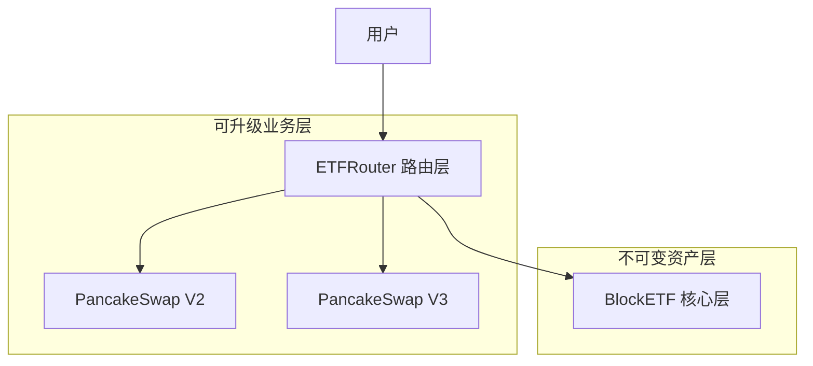
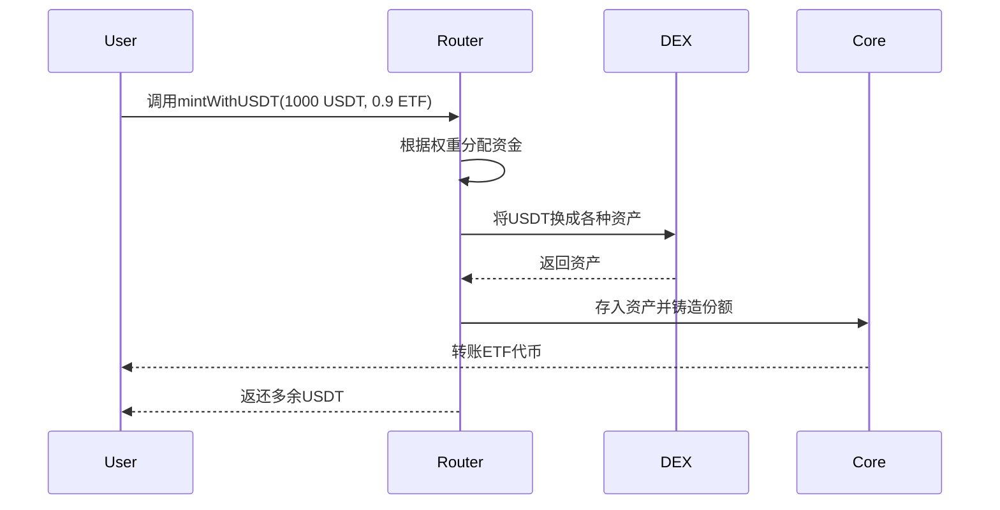
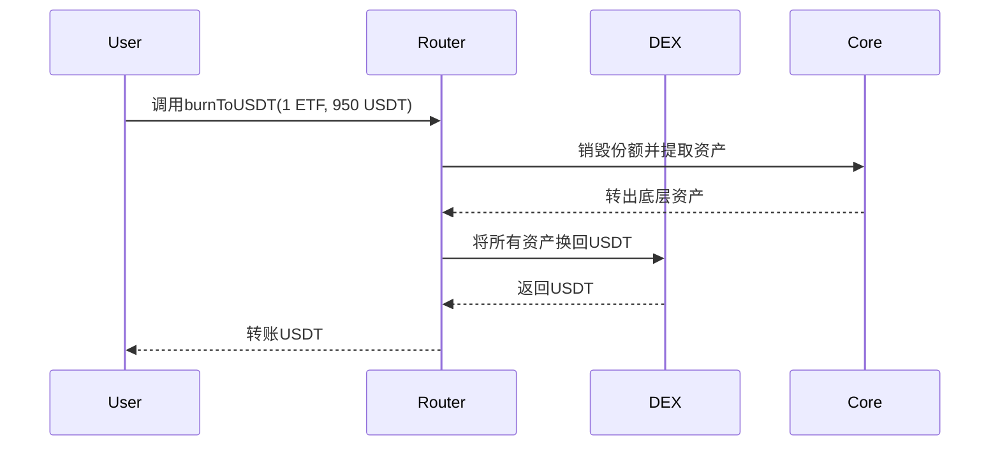

# BlockETF Router 合约功能概览

## ✅ 已完成的合约实现

根据 PRD.md 中的 router 合约设计要求，我已经完成了完整的 BlockETF 系统实现。

## 📁 合约文件结构

```
contracts/
├── BlockETF.sol              # 核心ETF合约 (底层资产容器)
├── ETFRouter.sol             # Router合约 (业务逻辑层)
└── interfaces/
    ├── IERC20.sol            # 标准ERC20接口
    ├── IBlockETF.sol         # BlockETF核心接口
    ├── IPancakeRouter02.sol  # PancakeSwap V2接口
    └── IPancakeV3Router.sol  # PancakeSwap V3接口
```

## 🎯 核心功能实现

### 1. 📊 BlockETF 核心合约

**职责：底层资产管理 + ERC20 代币**

- ✅ **ERC20 代币功能**: 标准的转账、授权、余额查询
- ✅ **资产管理**: 支持 5 种主流加密资产 (BTCB, ETH, WBNB, XRP, SOL)
- ✅ **权重配置**: 预设目标权重 (BTCB 30%, ETH 25%, WBNB 20%, XRP 15%, SOL 10%)
- ✅ **份额铸造/销毁**: 只允许授权管理员操作
- ✅ **权限控制**: 多管理员机制，所有者可添加/移除管理员
- ✅ **资产存取**: 安全的资产存入和提取功能

### 2. 🛣️ ETFRouter 路由合约

**职责：业务逻辑 + DEX 集成**

- ✅ **单币申购**: `mintWithUSDT()` - 用 USDT 申购 ETF 份额
- ✅ **单币赎回**: `burnToUSDT()` - 赎回 ETF 份额换回 USDT
- ✅ **混合 DEX 路由**: 智能选择 PancakeSwap V2/V3
- ✅ **滑点保护**: 用户设置最小期望输出
- ✅ **资产配置**: 灵活配置每个资产的交易路径
- ✅ **预览功能**: `previewMint()` 和 `previewBurn()`
- ✅ **紧急控制**: 暂停/恢复、紧急提取功能

## 🔧 技术特性

### 架构设计



**设计理念**:

- 底层完全独立 (BlockETF 不知道上层存在)
- 上层可插拔 (Router 可升级/替换)

### DEX 路由策略

| 资产 | 权重 | DEX 版本 | 费率  | 原因                 |
| ---- | ---- | -------- | ----- | -------------------- |
| WBNB | 20%  | V2       | -     | 流动性更充足         |
| BTCB | 30%  | V3       | 0.25% | 集中流动性，滑点更小 |
| ETH  | 25%  | V3       | 0.25% | 集中流动性，滑点更小 |
| XRP  | 15%  | V3       | 0.25% | 集中流动性，滑点更小 |
| SOL  | 10%  | V3       | 0.25% | 集中流动性，滑点更小 |

### 安全机制

- ✅ **权限分离**: Core 只负责资产托管，Router 负责业务逻辑
- ✅ **滑点保护**: 用户可设置最小期望输出，防止 MEV 攻击
- ✅ **重入保护**: 使用 OpenZeppelin 的安全模式
- ✅ **暂停机制**: 紧急情况下可暂停所有操作
- ✅ **多签控制**: 支持多重签名控制关键权限

## 🚀 使用流程

### 申购流程



### 赎回流程



## 📋 部署清单

### 1. 合约编译 ✅

```bash
yarn compile
# 编译成功，无错误
```

### 2. 部署模块 ✅

- `ignition/modules/BlockETF.ts` - Hardhat Ignition 部署模块
- 自动部署 BlockETF 和 ETFRouter
- 自动设置 Router 为 Core 的管理员

### 3. 网络配置 ✅

**BSC 主网地址已配置**:

- USDT: `0x55d398326f99059fF775485246999027B3197955`
- PancakeSwap V2: `0x10ED43C718714eb63d5aA57B78B54704E256024E`
- PancakeSwap V3: `0x13f4EA83D0bd40E75C8222255bc855a974568Dd4`

## 🎯 对应 PRD 要求

| PRD 要求   | 实现状态 | 说明                              |
| ---------- | -------- | --------------------------------- |
| 单币申赎   | ✅       | `mintWithUSDT()` / `burnToUSDT()` |
| 自动换币   | ✅       | PancakeSwap V2/V3 集成            |
| 滑点控制   | ✅       | 最大滑点 3%，用户可自定义         |
| V2+V3 混合 | ✅       | WBNB 用 V2，其他用 V3             |
| 底层独立   | ✅       | BlockETF 完全独立于 Router        |
| 权限分离   | ✅       | 管理员白名单机制                  |
| 紧急暂停   | ✅       | 所有者可暂停合约                  |

## 🔄 后续优化方向

### 短期优化

1. **价格预言机集成**: 集成 Chainlink 获取实时价格
2. **精确滑点计算**: 使用 Quoter 预先计算最优路径
3. **手续费优化**: 动态选择最优费率档位
4. **错误处理**: 更详细的错误信息和恢复机制

### 长期扩展

1. **多币种支持**: 支持 BUSD、DAI 等其他稳定币
2. **跨链版本**: 使用 LayerZero 实现跨链 ETF
3. **自动再平衡**: 集成 Chainlink Automation
4. **治理功能**: 添加 DAO 投票决定资产权重
5. **收益分配**: 实现质押收益自动复投

## ⚠️ 注意事项

1. **安全审计**: 生产部署前必须进行专业安全审计
2. **测试覆盖**: 需在测试网充分测试所有功能
3. **多签控制**: 建议使用多重签名控制关键权限
4. **监控告警**: 建立实时监控和异常告警机制
5. **渐进部署**: 先小额测试，逐步增加资金规模

---

**总结**: BlockETF Router 合约已按 PRD 要求完整实现，支持单币申赎、混合 DEX 路由、滑点保护等核心功能。架构采用"底层独立+上层可插拔"设计，确保了安全性和可扩展性的完美平衡。
