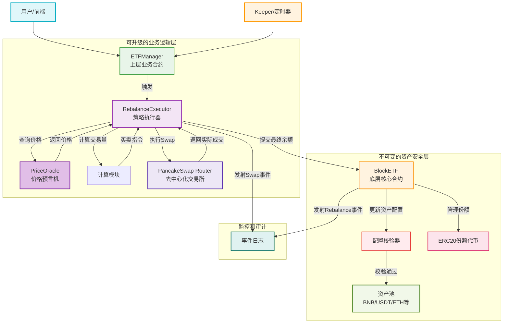

# **BlockETF 项目需求文档（BNB Chain + Solidity 版）**

## **一、产品概述**

### **1.1 产品定位**

**BlockETF** 是一个运行在 **BNB Chain** 上的去中心化指数基金平台，允许用户通过单一代币（USDT 或 BUSD）申购由 **Top 5 主流加密资产（BTC、ETH、XRP、SOL、BNB）** 组成的 ETF Token。

ETF 持仓比例示例：

| **代币** | **权重** |
| -------- | -------- |
| BTC      | 30%      |
| ETH      | 25%      |
| BNB      | 20%      |
| XRP      | 15%      |
| SOL      | 10%      |

ETF Token（**bETF-Top5**）反映这 5 种资产的组合价值，用户可通过智能合约一键申购或赎回，并实时查看净值（NAV）。

---

## **二、目标用户**

| **用户类型** | **需求**               | **目标**              |
| ------------ | ---------------------- | --------------------- |
| 普通投资者   | 想长期持有主流加密资产 | 一键分散风险投资      |
| DeFi 用户    | 熟悉钱包与 DEX 操作    | 低滑点投资组合        |
| DAO / 金库   | 管理组合资产           | 自动再平衡 + 透明账本 |
| 被动投资者   | 不想频繁交易           | 自动跟踪市场走势      |

---

## **三、MVP 核心功能**

### **3.1 单币申赎**

- 用户使用 **USDT/BUSD** 申购或赎回 ETF。
- 合约根据当前币价自动兑换目标比例资产。
- 自动发行 / 销毁对应数量的 ETF Token。

### **3.2 自动换币（Swap Aggregator）**

- **集成 ** **1inch 或 PancakeSwap Router** **。**
- 实现自动路径优化与滑点控制。
- 支持多币种兑换到目标资产篮子。

### **3.3 NAV 计算**

- **使用 \*\***Chainlink 预言机\*\* 获取各币种价格。
- 按照资产权重和 Vault 持仓计算 ETF 单位净值。
- 公开 **getNAV()** 接口供前端和分析服务调用。

### **3.4 自动再平衡**

-
-
- 每 24 小时检测一次资产比例偏离。
- **由 \*\***Keeper Bot（链下自动任务）\*\* 调用合约执行再平衡。
- 交易通过 PancakeSwap 自动完成。

---

## **四、技术架构设计**

### **4.1 系统架构图（逻辑结构）**

```mermaid

```

```
+---------------------------------------------+
|                用户前端 (React)             |
|   - ETF 列表 / 详情页 / 申购页 / 个人中心    |
|   - 钱包连接 (MetaMask / WalletConnect)     |
+----------------------|----------------------+
                       |
                       v
+---------------------------------------------+
|            后端服务 (Node.js / NestJS)      |
|   - NAV 缓存与历史记录                       |
|   - Keeper Bot (再平衡触发器)                |
|   - Price Feed Proxy                        |
+----------------------|----------------------+
                       |
                       v
+---------------------------------------------+
|            智能合约层 (Solidity)            |
|   ETFVault.sol         - 资产托管与再平衡    |
|   ETFToken.sol         - ETF ERC20 代币发行  |
|   ETFRouter.sol        - 申购赎回逻辑        |
|   PriceOracle.sol      - 预言机适配          |
|   Keeper.sol           - 自动再平衡入口      |
+---------------------------------------------+
                       |
                       v
+---------------------------------------------+
|               基础设施层                     |
|   - Chainlink Oracle (BNB)                  |
|   - PancakeSwap / 1inch Aggregator          |
|   - BNB Chain (BSC Mainnet / Testnet)       |
+---------------------------------------------+
```

---

### **4.2 智能合约目录结构**

```
contracts/
 ├── ETFVault.sol         # 管理资产池、比例与兑换
 ├── ETFRouter.sol        # 申购赎回逻辑入口
 ├── ETFToken.sol         # ERC20代币 (bETF-Top5)
 ├── PriceOracle.sol      # 调用 Chainlink 价格喂价
 ├── Keeper.sol           # 定期再平衡执行合约
 └── interfaces/
     ├── IPancakeRouter.sol
     ├── IChainlinkOracle.sol
     └── IERC20.sol
```

### **4.3 技术栈选择**

| **层级**         | **技术**                                       | **说明**      |
| ---------------- | ---------------------------------------------- | ------------- |
| **主链**         | **BNB Chain (EVM)**                            | 主部署网络    |
| **智能合约**     | **Solidity (v0.8.x)**                          | 主开发语言    |
| **开发框架**     | **Foundry / Hardhat**                          | 测试与部署    |
| **前端**         | **Next.js + wagmi + RainbowKit + TailwindCSS** | 钱包集成与 UI |
| **后端服务**     | **NestJS + PostgreSQL + Redis**                | NAV 缓存、API |
| **预言机**       | **Chainlink**                                  | 实时价格获取  |
| **DEX 集成**     | **PancakeSwap / 1inch Aggregator**             | 自动换币      |
| **任务自动化**   | **Node.js Keeper Bot + CronJob**               | 定期再平衡    |
| **部署与 CI/CD** | **Docker + GitHub Actions + AWS / Cloudflare** | 自动化部署    |

---

## **五、用户界面流程**

```
[首页]
  ↓
[ETF 列表页] → 查看ETF详情 → 点击“申购”
  ↓
[申购页]
  - 输入申购金额（USDT）
  - 显示目标资产分配比例
  - 用户确认签名
  ↓
[交易确认页]
  - 显示ETF Token余额、交易哈希
  ↓
[个人中心]
  - 查看ETF持仓
  - 查询实时NAV
  - 发起赎回操作
```

---

## **六、开发里程碑**

| **阶段**                          | **时间周期** | **目标**                          | **主要交付物** |
| --------------------------------- | ------------ | --------------------------------- | -------------- |
| **阶段 1：MVP 原型**              | 第 1–2 个月  | 实现单币申购、赎回、NAV 查询      | Testnet Demo   |
| **阶段 2：自动换币 + 前端上线**   | 第 3–4 个月  | 集成 PancakeSwap，构建 DApp UI    | Beta 版本      |
| **阶段 3：自动再平衡 + 主网部署** | 第 5–6 个月  | 完整 ETF 流程 + Keeper Bot 自动化 | 主网正式上线   |

---

## **七、成功指标（KPI）**

| **阶段**        | **指标**          | **目标值** |
| --------------- | ----------------- | ---------- |
| 短期（3 个月）  | 测试用户数        | ≥ 500      |
| 中期（6 个月）  | 主网锁仓量（TVL） | ≥ $1M      |
| 长期（12 个月） | 支持 ETF 产品数量 | ≥ 3 个     |
| 长期            | 年化留存率        | ≥ 60%      |
| 长期            | 日活交易量        | ≥ 300 笔   |

---

## **八、风险分析与应对策略**

| **风险类别**       | **描述**                   | **应对策略**                              |
| ------------------ | -------------------------- | ----------------------------------------- |
| **智能合约风险**   | 逻辑错误或漏洞导致资产损失 | 外部审计（CertiK / PeckShield）+ 多签控制 |
| **价格预言机风险** | Chainlink 数据异常         | 冗余备份（自建喂价或 API 备援）           |
| **DEX 流动性风险** | PancakeSwap 深度不足       | 使用 1inch 聚合器自动分流                 |
| **再平衡频率风险** | 高频执行导致 Gas 成本高    | 调整再平衡触发阈值、批量交易              |
| **市场风险**       | 资产波动导致 NAV 异常      | 透明披露 + 预警机制                       |
| **合规风险**       | ETF 名称触及证券监管       | 使用 “Index Basket Token” 命名避免争议    |

---

## **九、未来扩展方向**

- 多 ETF 产品线（如 bETF-BlueChip、bETF-Layer2）
- 增加收益分配功能（质押或借贷收益自动复投）
- 跨链 ETF 版本（使用 LayerZero / Wormhole）
- DAO 投票决定资产权重
- 增加「稳定币 ETF」、「DeFi 指数」等主题产品

# 底层合约设计

## 主要功能

**1. 资产管理**

**主要包括初始化和修改资产配置，包括底层资产列表和对应的权重。**

**2. 份额代币的铸造和赎回**

**用户可以通过投入一篮子底层资产来铸造对应数量的 ETF 份额代币，也可以通过赎回份额代币来换回等值的底层资产。**

**3. 手续费的设置和收取**

**费率结构设置了赎回费和管理费，以份额的方式进行收取。**

**4. 再平衡的底层逻辑**

**采用了类似闪电贷的方式执行再平衡策略，由上层合约决定具体的执行策略，底层对结果进行校验。**

---

## **🧠 一、核心理念 — 底层完全独立**

你定义的理念：

> “BlockETF 作为底层核心合约，完全独立；上层（Router/Manager）调用底层，底层不知道上层的存在。”

这句话非常重要，它意味着：

- **BlockETF** 不依赖任何上层逻辑。
- 上层可以变化、扩展或替换（例如换 DEX、改策略）。
- **BlockETF** 成为真正稳定的“ **资产容器 + 份额逻辑核心** **”。**

这种思想和 **Uniswap V3、Curve、Aave** 等成熟 DeFi 协议的架构是一致的：

> “核心池逻辑稳定，外围逻辑灵活可换。”

---

## **🧱 二、改进架构结构图**

```
┌──────────────────────────────┐
│        用户 / 前端 / DApp       │
└────────────┬─────────────────┘
             │
             ▼
┌──────────────────────────────┐
│      ETFManager（上层合约）     │
│ - 调用 BlockETF.mint/burn     │
│ - 执行 Swap / 计算最优路径     │
│ - 集成 PancakeSwap Router     │
│ - 申购 / 赎回 / NAV计算        │
└────────────┬─────────────────┘
             │ 调用接口
             ▼
┌──────────────────────────────┐
│       BlockETF（底层核心）     │
│ - ERC20份额代币              │
│ - 资产接收与提取              │
│ - mint / burn                 │
│ - 管理费累积逻辑              │
│ - 不知道DEX或Manager的存在     │
└──────────────────────────────┘
```

---

## **⚙️ 三、模块职责划分**

### **🟢 1️⃣** \*\*\*\*

### **BlockETF**

### **（核心合约）**

**角色定位：底层资产与份额容器**

**主要职责：**

- 继承 **ERC20** → 实现份额代币；
- **提供 **mint(address to, uint amount)** 和 **burn(address from, uint amount)**；**
- 接收用户资产（USDT、BNB、ETH 等）；
- 支持从池中提取资产；
- 累计管理费；
- 管理资产配置（记录权重、持仓比例）。

**不做的事：**

- ❌ 不进行 swap；
- ❌ 不接入 PancakeSwap；
- ❌ 不计算最优路径；
- ❌ 不关心谁调用，只验证权限。

**🧠 \*\***它是“资产金库 + 份额凭证”，而不是交易执行者。\*\*

---

### **🟢 2️⃣** \*\*\*\*

### **ETFManager**

### **（上层业务合约）**

**角色定位：智能基金管理逻辑层**

**主要职责：**

- 处理用户交互（deposit、withdraw）；
- 调用 PancakeSwap Router 执行资产换购；
- 计算申购/赎回对应份额；
- **调用底层 **BlockETF.mint()** 或 **burn()**；**
- 管理费结算与 NAV 计算；
- 可以扩展接入其他 DEX（如 Uniswap、ApeSwap）；
- 可以添加不同投资策略模块（如固定比例、动态再平衡）。

**🧠 \*\***它是策略执行层，可替换、可扩展。\*\*

---

## **🧩 四、核心改进点**

| **对比维度**     | **旧架构（Vault 主导）**         | **新架构（独立核心）**         |
| ---------------- | -------------------------------- | ------------------------------ |
| **核心逻辑位置** | Vault 掌握一切（资产+份额+交易） | BlockETF 仅掌握份额和资产存储  |
| **依赖关系**     | Token 依赖 Vault                 | Manager 依赖 ETF               |
| **可扩展性**     | 改 Vault 会影响份额逻辑          | 改 Manager 不影响底层 ETF      |
| **安全性**       | Vault 错误可能影响代币           | ETF 权限单一，逻辑更纯净       |
| **可维护性**     | 逻辑混合，升级复杂               | 分层清晰，独立测试             |
| **DEX 依赖**     | Vault 耦合 Pancake               | Manager 封装 DEX 接口          |
| **升级方式**     | Vault 通过 Proxy                 | Manager 可多版本共存，ETF 独立 |

---

## **🔒 五、安全优势**

这种架构显著降低了权限风险：

1. **BlockETF 权限最小化**
   只允许被授权的 Manager 调用 **mint()** 和 **burn()**；
   **通过 **AccessControl** 或 **Ownable** 限制。**

```
modifier onlyManager() {
    require(managers[msg.sender], "Not authorized");
    _;
}
```

1.
2. **Manager 可热插拔、可替换**
   可以注册多个策略管理合约，灵活部署新策略而不改底层逻辑。

```
function setManager(address _manager, bool _active) external onlyOwner;
```

2.
3. **BlockETF 永不升级（immutable）**
   一旦部署完成，不允许逻辑升级；
   只接受调用，不发起调用；
   资产安全性极高。

---

## **🧠 六、设计哲学类比**

| **类比对象** | **BlockETF**    | **ETFManager**        |
| ------------ | --------------- | --------------------- |
| 银行体系     | 银行金库        | 柜台+系统             |
| 操作系统     | 内核 (Kernel)   | 用户空间 (Userland)   |
| DeFi 协议    | Uniswap V3 Pool | Router / Swap Manager |

**👉 \*\***金库（ETF）不认识谁在用它，只负责保存和计数。\*\*

**👉 \*\***Router/Manager 是策略和业务层，可以不断演化。\*\*

---

## **🚀 七、未来扩展潜力**

这种“底层独立 + 上层可插拔”的架构，非常适合未来扩展：

- ✅ **支持多策略组合管理**（不同 Manager 对应不同策略）
- ✅ **支持跨链资产托管**（底层金库不动，上层跨链调用）
- ✅ **支持多币种 ETF 产品**（一个核心框架，多种 Manager 配置）
- ✅ **兼容治理模块（DAO）**，通过 DAO 决定 Manager 切换。

---

## **⚠️ 八、需要注意的设计细节**

1. **mint/burn 权限管理**
   - **BlockETF** 不应允许任何人直接 mint；
   - 应通过 Manager 白名单机制。
2. **资产接收函数**
   - **必须严格检查 **msg.sender**；**
   - 防止恶意代币注入金库（污染资产池）。
3. **NAV 计算一致性**
   - NAV 不应由底层计算；
   - 应由 Manager 或外部 Oracle 计算后再传入。
4. **事件追踪**
   - BlockETF** 发出事件 **Minted**, **Burned**, **AssetDeposited**；**
   - 上层合约监听这些事件来对账。

---

## **✅ 九、总结一句话**

> **BlockETF 是“不可变的底层金库”，ETFManager 是“可演化的策略大脑”。**

> 这种架构通过“下层稳定，上层可变”实现了：

> **高安全性 + 高扩展性 + 模块解耦 + 未来兼容性。**


# rebalance 设计

Rebalance（再平衡）是指：

> 定期或基于触发条件调整 ETF 内各资产的权重，使之恢复到目标配置比例。

例如：

> BlockETF 目标权重：BTC 50%，ETH 30%，BNB 20%

> 若实际权重偏离目标超过阈值，就通过 Swap 调整持仓。



## 🔧 核心校验逻辑（BlockETF 内部）

```solidity
// BlockETF.sol - 核心校验机制
function submitRebalance(
    address[] calldata assets,
    uint256[] calldata newBalances,
    uint256 expectedTotalValue
) external onlyManager {
    // 1. 总额校验
    uint256 actualTotalValue = calculateTotalValue(assets);
    require(actualTotalValue >= expectedTotalValue * 99 / 100, "Value mismatch");

    // 2. 偏差校验
    for(uint i = 0; i < assets.length; i++) {
        uint256 targetWeight = targetWeights[assets[i]];
        uint256 actualWeight = newBalances[i] * 1e18 / actualTotalValue;
        uint256 deviation = absDiff(actualWeight, targetWeight);
        require(deviation <= maxDeviation, "Deviation exceeded");
    }

    // 3. 更新状态
    for(uint i = 0; i < assets.length; i++) {
        assetBalances[assets[i]] = newBalances[i];
    }

    // 4. 累积管理费
    accumulateManagementFee();

    emit Rebalanced(assets, newBalances, actualTotalValue);
}
```

## 📊 数据流验证

| 阶段         | 输入           | 处理         | 输出     | 安全校验           |
| ------------ | -------------- | ------------ | -------- | ------------------ |
| **策略计算** | 当前价格、持仓 | 计算目标权重 | 买卖指令 | 价格来源可信       |
| **DEX 执行** | 买卖指令       | 执行 Swap    | 实际成交 | 滑点控制           |
| **结果提交** | 新余额数组     | 校验逻辑     | 状态更新 | 总额一致、偏差合规 |

## 🛡️ 安全边界

1. **核心层不可变** - BlockETF 逻辑固定，资产安全
2. **策略层可升级** - Rebalance 逻辑可优化替换
3. **结果校验** - 只接受合规的资产配置
4. **权限分离** - 执行权 ≠ 资产控制权

该设计确保了即使上层合约被攻击，底层资产也不会被非法转移，真正实现了"核心资产安全"与"业务逻辑灵活"的完美平衡。

# router 合约设计

## MVP 功能

- **单一入口** ：只支持 USDT
- **目标资产** ：BTCB、ETH、XRP、SOL、WBNB
- **核心函数** ：`mintWithUSDT()` 和 `burnToUSDT()`
- **滑点保护** ：避免用户损失
- **DEX 集成** ：先用 PancakeSwap 做流动性入口

## PancakeSwap 版本选择

- BTCB/ETH/XRP/SOL：V3 更好
- WBNB：只在 V2 有流动性

因此采用了 **V2+V3 混合架构**

| **特性**         | **V2**                     | **V3**                                  |
| ---------------- | -------------------------- | --------------------------------------- |
| **流动性模式**   | 常规恒定乘积 AMM（x\*y=k） | 集中流动性 (Concentrated Liquidity)     |
| **价格范围**     | 整个价格区间               | 可自定义价格区间（提高资本效率）        |
| **手续费灵活性** | 固定                       | 可选不同费率档位（0.05%, 0.25%, 1%）    |
| **适用资产**     | 所有交易对均可创建流动性   | 对于流动性较低或小币种，可能没有足够 LP |
| **滑点**         | 较大                       | 资本利用率高，滑点小（集中流动性）      |

### **不同资产流动性分布差异**

- **BTCB / ETH / XRP / SOL**
  - 是 PancakeSwap 上流动性较高的资产，且用户和 LP 集中在价格特定区间
  - 使用 **V3 集中流动性** 可以极大降低滑点，提高资本效率
- **WBNB**
  - 是 BSC 上最基础、交易量最大的资产
  - V3 上 WBNB 对 USDT/BUSD/其他稳定币的 LP 极少甚至不存在
  - 反而在 **V2 池里流动性充足**，滑点更低，交易成本更可控

### 原因总结

1. **V3 流动性池存在分布不均问题**
   - 流动性提供者（LP）选择集中在特定价格区间
   - 对一些资产，如果 LP 没有在你需要的价格区间提供流动性，就无法成交或滑点大
2. **V2 是全区间流动性**
   - 恒定乘积 AMM，整个价格区间都有流动性
   - 对 WBNB 这种高频交易、全链基础币来说，V2 流动性比 V3 高
3. **交易滑点和执行成本**
   - 对大额交易或 ETF rebalance，需要保证成交量和低滑点
   - 采用 V2 处理 WBNB 可降低滑点风险
   - 对 BTCB/ETH/XRP/SOL，用 V3 提高资本利用率，减少 LP 成本


## 路由策略

- 有配置的池就走配置池
- 没有配置则走默认直换

## 费率配置

直接配置池地址

## 混合 `DEX`配置

- WBNB：走 V2
- 其他：走 V3

> Router 内部做了自动判断，用户无感知。

## 实现要点

```solidity
function mintWithUSDT(...) external returns (uint256 shares);
function burnToUSDT(...) external returns (uint256 usdtAmount);
```

- **申购** ：用户给 USDT → Router 拆分兑换成目标资产 → 调用 Core 铸造份额 → 返回多余 USDT
- **赎回** ：用户交回份额 → Core 退回底层资产 → Router 换回 USDT → 转给用户

这中间的优化点在于：

- 用 `<span leaf="">mintExactShares</span>` 来提高精度
- 支持管理员灵活配置池和滑点参数
- 保留紧急暂停功能

## 最终架构

最终架构大致是这样的：

```bash
USDT <——> Router <——> Core
             │
             ├─ PancakeSwap V2 (WBNB)
             └─ PancakeSwap V3 (BTCB/ETH/XRP/SOL)
```

它的特性包括：

- 智能路由，自动走最优路径
- V2+V3 混合，充分利用流动性
- 精确份额控制，减少滑点
- 灵活配置，可快速调整
